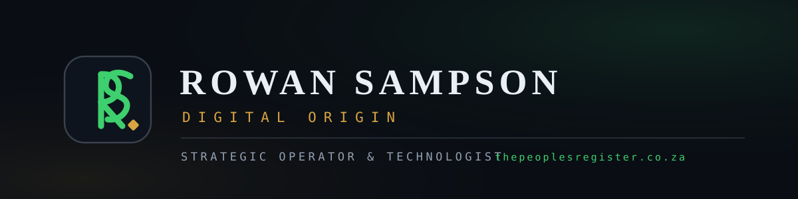

# Hi — I'm Rowan Sampson.

**Strategic Operator & Technologist**: governance-fluent, code-capable, commercially literate.

   

I pair institutional governance and national executive advisory with end-to-end digital product delivery. Two terms on the Nelson Mandela University SRC and service in the office of the YCLSA National Secretary led to founding **Digital Origin** and building **The People's Register** as its conceptual architect and lead developer.

---

## Now building

- **[The People's Register](https://www.thepeoplesregister.co.za)** — a live civic publication platform: interactive field journal, SEO architecture, consent-first email automation, trilingual (EN / isiXhosa / Afrikaans), in production on Vercel.
- **Release cadence** — continuous improvement, versioned editions, measured on the live page.

## Pinned work

| Repo | What it demonstrates |
|---|---|
| `the-peoples-register` | Architecture documentation of the flagship build — the five phases, the SEO layer, security posture, and the journal system. |
| `pdf-edition-pipeline` | The Python pipeline that generates the journal's downloadable editions — with a runnable sample. |
| `rowansampson-portfolio` | The source of my portfolio site — single file, zero dependencies, fully versioned. |
| `email-automation` | The consent-first newsletter system: sequence templates, segmentation model, compliance notes. |

## Writing & copy

Contemporary samples across five formats — technical writing, the practitioner essay, email, ads and landing copy — live on the [portfolio](https://www.linkedin.com/in/rowansampson).

## Connect

- **Portfolio** — [rowan-sampson-portfolio.vercel.app](https://rowan-sampson-portfolio.vercel.app) (primary) · [rowansampson.github.io](https://rowansampson.github.io) (mirror)
- **LinkedIn** — [linkedin.com/in/rowansampson](https://www.linkedin.com/in/rowansampson)
- **Email** — info.rowansampson@gmail.com
- **WhatsApp** — +27 70 403 7385

---

*Executive CV available on request. Everything here is built in public — measured, not claimed.*
